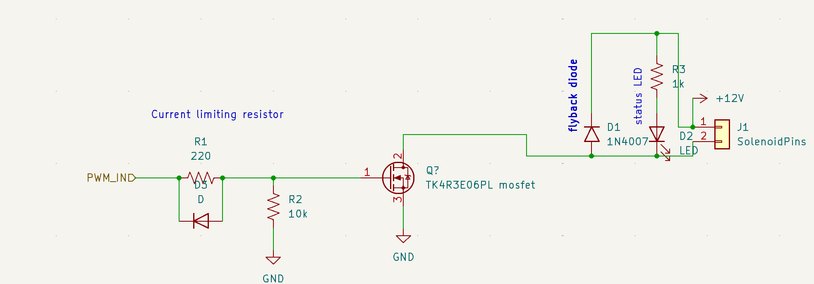

[](https://github.com/madskjeldgaard/raspberry-pi-pico-usbmidi-platformio-template/actions/workflows/build.yml)

# MIDI 2 solenoid controller

 

This firmware will turn a Raspberry Pi Pico with 4 solenoids connected via pwm into a USB midi to solenoid motor controller boards.

It maps midi notes to one of the 4 solenoids. Note on turns it on, note off turns it off.

These midi notes are 60-63.

It also features a small auto sleep function which will turn off the solenoids if left idle, just as a safety measure.

## Hardware

In the circuit pictured above, this is how each channel is laid out. One of these channel maps the pwm output of the pico to a solenoid using a MOSFET. It is quite reliable. It can supposedly be even better if you add a logic gate driver but I am not sure how to do it, so please open up an issue or PR if you know how to improve on it. Here is what each of those channels look like [in a schematic](hardware/mosfet_based_solenoid_voice.kicad_sch):



## Dependencies

You need to have platformio installed to make use of this.

Install it on MacOS by running homebrew:

```bash
brew install platformio
```

## Compiling and uploading

To compile and upload your sketch, simply run the following command:

```bash
pio run -t upload
```
